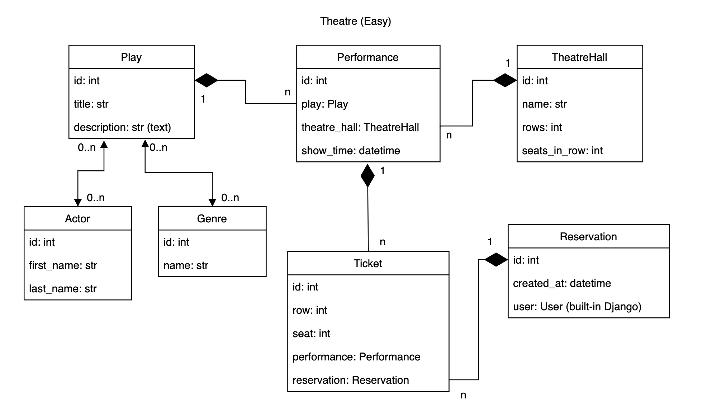

# Theatre Service API

API service for theatre management written on DRF

## Features
- JWT authenticated
- Admin panel /admin/
- Documentation is located at /api/doc/swagger/
- Managing reservations and tickets
- Creating play with genres, actors
- Creating theatre halls
- Adding performances
- Filtering plays and performances 


## Model Diagram



## Setup

### Clone the Repository
Clone the repository to your local machine:
```bash
git clone https://github.com/your-repository.git
cd your-repository
```

### Virtual Environment

Create a virtual environment:
```bash
python -m venv env
```
Activate the virtual environment:
- On Windows:
```bash
.\env\Scripts\activate
```
- On macOS/Linux:
```bash
source env/bin/activate
```

### Install Requirements

Install the required packages:
```bash
pip install -r requirements.txt
```

### Database Setup

Set environment variables:
```bash
set DB_HOST=<your db hostname>
set DB_NAME=<your db name>
set DB_USER=<your db usermane>
set DB_PASSWORD=<your db user password>
set SECRET_KEY=<your secret key>
```

Apply migrations to create the necessary database tables:
```bash
python manage.py migrate
```
Create a superuser for Django admin access:
```bash
python manage.py createsuperuser
```

### Run with docker

Docker should be installed
```bash
docker-compose build
docker-compose up
```

### Getting access

- create user via /api/user/register/
- get access token via /api/user/token/


If you want to load pre-populated data into 
the database, use the following command:

```bash
python manage.py loaddata data.json
```
